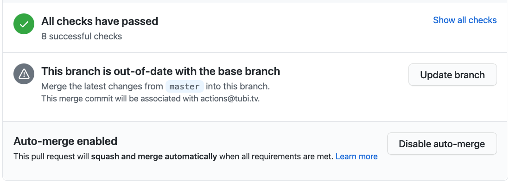

# Update PR Branch Action


[](https://coveralls.io/github/adRise/update-pr-branch)

> Automatically update the PR branch

The job of the action is to help click "Update branch" button for you. Designed to work with the `auto-merge` and ["Require branches to be up to date before merging"](https://docs.github.com/en/github/administering-a-repository/about-protected-branches#require-status-checks-before-merging) options. It will update the newest open PR that match the below conditions

- The PR has the `auto-merge` option enabled
- The PR has 2 approvals and no changes-requested review (configurable)
- The PR has all checks passed (configurable)
- The PR branch has no conflicts with the base branch
- The PR branch is behind the base branch

## When do you need this action

You may consider to use this action if you:

- Have enabled the `auto-merge` [feature](https://docs.github.com/en/github/collaborating-with-issues-and-pull-requests/automatically-merging-a-pull-request) in your repo.
- Have checked the "Require branches to be up to date before merging" checkbox for protected branches. See more [Require status checks before merging](https://docs.github.com/en/github/administering-a-repository/about-protected-branches#require-status-checks-before-merging)

Because of #2, even you have enabled `auto-merge` for a PR, the PR won't be automatically merged if the PR branch is behind the base branch, for example someone else merges another PR before your PR passes all CI checks. See the screenshot as below.



## Inputs

### `token`

**Required**

The [personal access token](https://github.com/settings/tokens/).

Need to note, you can't use `GITHUB_TOKEN` because of [this limitation](https://docs.github.com/en/actions/reference/events-that-trigger-workflows#triggering-new-workflows-using-a-personal-access-token)

Alternatively, you can use a **GitHub App token** for better security and flexibility. See the "GitHub App Token Setup" section below.

### `base`

**Required**

Default: `master`

The base branch that the PR will use to fetch open PRs, for example, `main`, `master` or `dev`.

The action will only check PRs that use the `base` as the base branch.

### `required_approval_count`

**Required**

Default: 2

The action will skip PRs that have less approvals than `required_approval_count`.

We could retrieve this value from the repo settings through an API call but that will incur one more request. GitHub has [rate limit](https://docs.github.com/en/actions/reference/usage-limits-billing-and-administration#usage-limits) on API usage of GitHub actions.

### `require_passed_checks`

**Optional**

Default: true

The action will skip updating PRs that have failed checks. Please note that if `allow_ongoing_checks` is set to `false`, the action will skip updating PRs with ongoing checks. This will result in the failure to update PR branches when the action is triggered while checks for those PRs are still in progress.

### `allow_ongoing_checks`

**Optional**

Default: false

The action will consider PRs that have ongoing checks. This is useful when the action is triggered while checks for some otherwise qualified PRs are still in progress. Note, this option works only when `require_passed_checks` is set to `true`.

### `sort`

**Optional**

What to sort results by. Can be either `created`, `updated`, `popularity` (comment count) or `long-running` (age, filtering by pulls updated in the last month).

Notice: this is an option provided by github rest api. In this github action, we simply proxy this parameter (and the `direction` paramter below). Check more [here](https://octokit.github.io/rest.js/v18#pulls-list)

### `direction`

**Optional**

The direction of the sort. Can be either `asc` or `desc`. Default: `desc` when sort is `created` or sort is not specified, otherwise `asc`.

This github action doesn't set any default parameters.

### `require_auto_merge_enabled`

**Optional**

Check if having auto-merge enabled in the PR is required, in order for the PR to be considered. It defaults to `true`, but if set to `false`, all PRs are considered for update (not just those with auto-merge enabled).

## Example usage

### Using Personal Access Token

```yml
name: PR update

on:
  push:
    branches:
      - 'master'
jobs:
  autoupdate:
    runs-on: ubuntu-latest
    steps:
      - name: Automatically update PR
        uses: adRise/update-pr-branch@VERSION_YOU_WANT_TO_USE
        with:
          token: ${{ secrets.ACTION_USER_TOKEN }}
          base: 'master'
          required_approval_count: 2
          require_passed_checks: true
          allow_ongoing_checks: true
          sort: 'created'
          direction: 'desc'
          require_auto_merge_enabled: true
```

Replace the `VERSION_YOU_WANT_TO_USE` with the actual version you want to use, check the version format [here](https://docs.github.com/en/actions/reference/workflow-syntax-for-github-actions#jobsjob_idstepsuses)

### Using GitHub App Token

To improve security and flexibility, you can use a GitHub App token instead of a personal access token.

#### Steps to Set Up the GitHub App

1. **Create a GitHub App**:
   - Go to your GitHub Organization settings and create a new GitHub App.
2. **Generate a Private Key**:
   - Once the app is created, generate a private key for authentication.
3. **Assign Permissions**:
   - Grant the following permissions:
     - **Metadata**: Read access
     - **Content**: Read and write access
     - **Pull Requests**: Read and write access
4. **Install the App**:
   - Install the app on all repositories or specific repositories where this action will run.
5. **Save Variables and Secrets**:
   - Save the App ID as a repository or organization variable.
   - Save the private key as a repository or organization secret.

#### Example Usage with GitHub App Token

```yml
name: PR update

on:
  push:
    branches:
      - 'master'
jobs:
  autoupdate:
    runs-on: ubuntu-latest
    steps:
      - name: Create App token
        id: create_token
        uses: actions/create-github-app-token@v1
        with:
          app-id: ${{ vars.GITHUB_APP_ID }}
          private-key: ${{ secrets.GITHUB_APP_PRIVATE_KEY }}

      - name: Automatically update PR
        uses: adRise/update-pr-branch@VERSION_YOU_WANT_TO_USE
        with:
          token: ${{ steps.create_token.outputs.token }}
          base: 'master'
          required_approval_count: 2
          require_passed_checks: true
          allow_ongoing_checks: true
          sort: 'created'
          direction: 'desc'
          require_auto_merge_enabled: true
```

---

## Development

```bash
yarn
# this compile index.js to dest/init.js for running
yarn build
```

Note: You need to run `yarn build` before commit the changes because when the action only use the compiled `dest/index.js`.

